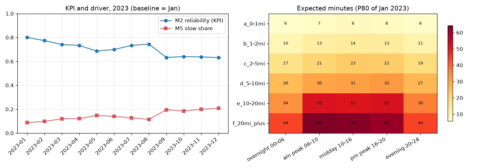
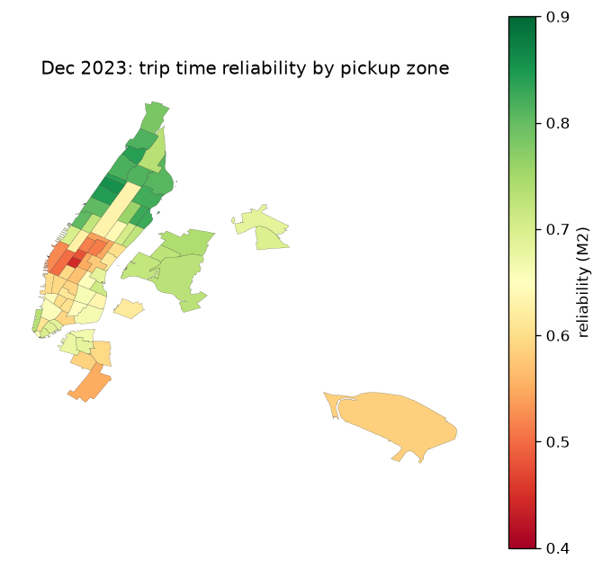

# Evidence Table — NYC TLC Monthly Trip Metrics (2023)

**Gate: PUBLISH** · coverage 97.97% (37,532,268 valid / 38,310,122 raw rows, 777,854 quarantined with reason codes)  
Generated by `python -m nyc_pipeline.evidence` from published artifacts · validation run `2026-09-27T09:31:27Z` · pipeline run `20260927_150114` (git None)

## Metrics — the number leadership tracks is **M2** (12 months of 2023)

| Month | Valid rate (M1) | **Reliability (M2)** | P50 (M3) | P90 (M3) | Invalid (M4) | Slow share (M5) | Trips |
|---|---:|---:|---:|---:|---:|---:|---:|
| Jan 2023 | 98.50% | **80.02%** | 11.6 min | 27.9 min | 1.50% | 8.77% | 3,020,708 |
| Feb 2023 | 98.57% | **77.43%** | 11.9 min | 28.5 min | 1.43% | 9.78% | 2,872,379 |
| Mar 2023 | 98.56% | **74.11%** | 12.2 min | 30.7 min | 1.44% | 11.94% | 3,354,652 |
| Apr 2023 | 98.77% | **73.37%** | 12.4 min | 31.8 min | 1.23% | 12.13% | 3,247,736 |
| May 2023 | 98.66% | **68.64%** | 13.1 min | 34.0 min | 1.34% | 14.78% | 3,466,532 |
| Jun 2023 | 98.55% | **69.94%** | 12.9 min | 33.5 min | 1.45% | 14.01% | 3,259,399 |
| Jul 2023 | 98.28% | **73.38%** | 12.5 min | 32.1 min | 1.72% | 12.74% | 2,856,951 |
| Aug 2023 | 97.96% | **74.43%** | 12.5 min | 32.2 min | 2.04% | 11.47% | 2,766,461 |
| Sep 2023 | 96.53% | **63.29%** | 13.7 min | 36.5 min | 3.47% | 19.55% | 2,747,891 |
| Oct 2023 | 96.54% | **63.98%** | 13.6 min | 34.9 min | 3.46% | 18.48% | 3,400,335 |
| Nov 2023 | 96.90% | **63.76%** | 13.4 min | 34.2 min | 3.10% | 19.96% | 3,236,211 |
| Dec 2023 | 97.82% | **63.17%** | 13.4 min | 34.4 min | 2.18% | 20.76% | 3,303,013 |

**Reading:** M2 is judged against expected durations = P80 of **2023-01** per distance-band × time-bucket (judgement call A4, **not** season-adjusted). The baseline month scores ~80% by construction — a fairness check on the ruler. Month-to-month movement mixes real change with seasonality (L4).

## Where the KPI loses time — hours (Dec 2023)

| Pickup hour | Trips | P50 | P90 | Slow share | Reliability |
|---:|---:|---:|---:|---:|---:|
| 15:00 | 211,377 | 15.1 | 43.8 | 29.3% | 56.3% |
| 14:00 | 202,387 | 15.2 | 42.1 | 28.9% | 57.8% |
| 17:00 | 220,403 | 14.7 | 40.6 | 28.9% | 55.5% |

## Where the KPI loses time — zones (Dec 2023, TLC zone ids)

| Pickup zone | Borough | Trips | Reliability | Slow share | P90 |
|---|---|---:|---:|---:|---:|
| Penn Station/Madison Sq West | Manhattan | 110,988 | 44.4% | 38.4% | 33.5 |
| Garment District | Manhattan | 53,614 | 47.8% | 37.6% | 31.3 |
| East Chelsea | Manhattan | 89,235 | 50.0% | 30.7% | 32.8 |
| Midtown Center | Manhattan | 144,381 | 51.2% | 34.8% | 29.6 |
| Times Sq/Theatre District | Manhattan | 110,249 | 51.5% | 30.8% | 35.7 |

| Segment | Trips | Share | Reliability | P50 | Slow share |
|---|---:|---:|---:|---:|---:|
| airport_zone | 147,996 | 4.5% | 58.5% | 41.8 | 0.8% |
| city_zone | 3,141,491 | 95.1% | 63.4% | 12.9 | 21.7% |
| zone_unknown | 13,526 | 0.4% | 65.1% | 13.0 | 18.8% |

## Retrieval evidence (API is the source of record)

- Months retrieved: **12/12** · rows stored **38,310,122** · reconciled against the API's own `COUNT(*)`: **12/12**
- Composite-key duplicates across the year: **2** (offset-paging integrity check)
- Raw API pages preserved under `data/api_raw/`; per-month parquet is hash-pinned in `data/manifest.json`
- Row conservation: raw == staged == quarantined + valid, asserted every run
- Rules: 15 PASS · 1 WARN · 0 FAIL · 6 UNKNOWN (`output/validation_report.json`)
  - ⚠ R06 distance_in_range: 2.02% fail — quarantine row — zero/negative/absurd distance breaks the KPI banding
  - ℹ R07 passenger_count_plausible: 4.94% flagged (within tolerance) — rows kept, see U5 in the K/U/A/L table
  - ℹ R08 money_non_negative: 1.00% flagged (within tolerance) — rows kept, see U5 in the K/U/A/L table
  - ℹ R10 ratecode_known: 3.98% flagged (within tolerance) — rows kept, see U5 in the K/U/A/L table
  - ℹ R11 store_and_fwd_known: 3.42% flagged (within tolerance) — rows kept, see U5 in the K/U/A/L table
  - ℹ R13 payment_type_known: 3.42% flagged (within tolerance) — rows kept, see U5 in the K/U/A/L table
  - ℹ R14 pickup_zone_resolved: 1.01% flagged (within tolerance) — rows kept, see U5 in the K/U/A/L table
  - ℹ R15 dropoff_zone_resolved: 1.44% flagged (within tolerance) — rows kept, see U5 in the K/U/A/L table

## Known / Unknown / Assumption / Limitation

| Type | ID | Statement | Owner / next step |
|---|---|---|---|
| Assumption | A1 | 1 row = 1 completed trip (TLC user guide). No trip ID exists, so the grain is enforced by full-row conservation (staged + quarantined == raw) plus a composite-key duplicate audit, instead of by a key. | FDE / client data lead |
| Assumption | A2 | Socrata delivers the 2023 schema in lowercase with quoted CSV headers and no coordinates. That is a REPRESENTATION difference (transport encoding + casing), not a semantic one, so it is normalised in retrieval and never guessed. | FDE (representation vs semantics call) |
| Assumption | A3 | Trips longer than 24h are meter errors, not real trips. Threshold is a judgement call and must be confirmed by the client before publish. | CLIENT — needs sign-off |
| Assumption | A4 | Expected durations for KPI M2 = P80 per (distance_band x time_bucket) computed on baseline month 2023-01; every month is judged against that one baseline and is NOT season-adjusted. | CLIENT — confirm baseline month + percentile before publishing M2 |
| Assumption | A5 | Each month is retrieved with a pickup-timestamp window, so 98 rows whose pickup falls outside calendar 2023 are out of scope by construction (0.0003% of the dataset). | FDE |
| Assumption | A6 | The 3.4% cohort with no ratecodeid / passenger_count / store_and_fwd_flag and payment_type = 0 is treated as REAL trips with missing metadata (their times, distances and durations are valid), not as corrupt rows — so they stay in the KPI population and are flagged (R10/R11/R13, U5). | CLIENT — confirm before publish |
| Assumption | A7 | The same 3.4% cohort has NULL airport_fee and NULL congestion_surcharge (the two newest columns) while its other money fields are complete. For the R09 arithmetic check a missing surcharge is read as 0; the rows stay disclosed by R10/R11/R13. | FDE (representation) / CLIENT (semantics) |
| Unknown | U1 | ratecodeid = 99 is not defined in the TLC user guide (213,480 rows). | CLIENT / TLC research@tlc.nyc.gov |
| Unknown | U2 | passenger_count = 0 / 7 / 8 / 9: unknown passenger, error, or courier trip? (583,414 rows) | CLIENT |
| Unknown | U3 | Zero-distance trips (2.02% of rows, rising to 3.4% by Sep-Nov) — meter fault, repositioning, or cancelled trip recorded as a fare? | CLIENT |
| Unknown | U4 | vendorid = 6 appears in 2023 (8,668 rows) but is not in the TLC user guide. | CLIENT / TLC |
| Unknown | U5 | 3.4% of rows carry no ratecodeid / passenger_count / store_and_fwd_flag, payment_type = 0, and NULL airport_fee / congestion_surcharge — vendor outage, or a submission path that skips this metadata? | CLIENT / TLC |
| Limitation | L1 | TLC did not create this data (technology providers do) and disclaims accuracy — absolute values carry unquantifiable meter error. | — |
| Limitation | L2 | This source has no coordinates: location is TLC's own zone id (1..265). 264/265 mean 'Unknown'/'NA' (about 1% of trips) and zone shapes approximate neighbourhoods, so zone-level numbers are zone-level, not street-level. | — |
| Limitation | L3 | No driver/vehicle IDs, no traffic/weather feeds — analysis is association-only. | — |
| Limitation | L4 | Seasonality is now measurable (12 months) but NOT adjusted for: month-over-month M2 movement mixes real change with weather/season effects. | — |
| Limitation | L5 | Money fields are unreliable: airport_fee / congestion_surcharge inclusion varies by row (26.7% of rows differ from the component sum by $1-2.50), and negatives are fare corrections. No money metric is published; the KPI is duration-based. | — |
| Known | K1 | Every month's row count equals the API's own COUNT(*) for the same window; raw pages, hashes and per-month provenance are preserved | — |

## Decision this output supports

**Publish** the 2023 monthly trip-performance report with the WARNs above disclosed (1 rules) and the open client questions (U1-U5); **direct operations** to the worst hours and worst zones. Do **not** publish causal claims (L3) or money metrics (L5).
